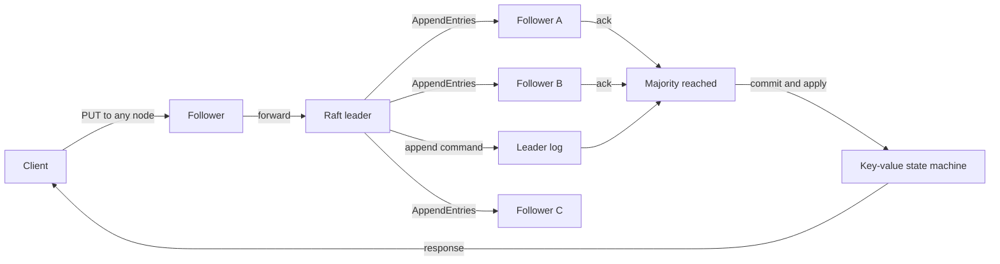

# Distributed Key-Value Store

A from-scratch, persistent key-value database built around the Raft consensus
algorithm. Five nodes elect one leader, replicate an ordered command log, and
apply a write only after a majority has acknowledged it.

The project is intentionally educational: the consensus code is visible and
small enough to study instead of being hidden behind a production Raft library.

## Current capabilities

- Randomized leader election and term-based voting
- `AppendEntries` heartbeats and log replication
- Majority-based commit decisions
- Follower-to-leader forwarding for `PUT`, `GET`, and `DELETE`
- Linearizable reads through a committed read barrier
- Persistent term, vote, log, and commit index with restart replay
- Five-node Docker Compose cluster with durable volumes
- Automated five-node election, replication, and leader-failover test
- Fault-injection demo that stops the active leader and measures recovery
- Concurrent benchmark client reporting throughput and p50/p95/p99 latency
- Race-detector and CI coverage

## System at a glance



In a five-node cluster, three matching copies form a majority. The cluster can
therefore continue processing requests after two crash-stop failures, provided
the remaining nodes can communicate.

See the [Project overview](docs/project-overview.md) for the interview-level
story, [System design](docs/architecture.md) for the protocol, and
[Codebase guide](docs/codebase.md) for where each responsibility lives.

## Run the five-node cluster

Requirements: Docker with Compose.

```bash
docker compose up --detach --build
```

Nodes are exposed on ports `8081` through `8085`. Find the elected leader:

```bash
for port in 8081 8082 8083 8084 8085; do
  curl -s "http://127.0.0.1:${port}/v1/status"
  echo
done
```

Send requests to any node. Followers proxy them to the current leader:

```bash
curl -i -X PUT http://127.0.0.1:8081/v1/kv/language \
  -H 'Content-Type: application/json' \
  -d '{"value":"Go"}'

curl -i http://127.0.0.1:8084/v1/kv/language

curl -i -X DELETE http://127.0.0.1:8082/v1/kv/language
```

Stop the cluster while preserving its volumes:

```bash
docker compose down
```

Use `docker compose down --volumes` only when you intentionally want to erase
the persisted node logs.

## Observe leader failover

The demo starts the cluster, discovers the leader, commits a value, stops that
leader, measures how long it takes to elect a replacement, writes again, and
restarts the failed node:

```bash
./scripts/failover-demo.sh
```

The script prints the measurement from the current machine. No performance or
failover number is claimed in this repository until it is reproduced by the
tooling and recorded with its environment.

## Benchmark

With the cluster running:

```bash
go run ./cmd/kvbench \
  -target http://127.0.0.1:8081 \
  -concurrency 50 \
  -duration 10s
```

The workload alternates a write and a linearizable read per client and reports
successful operations per second plus latency percentiles. Pass `-json` for
machine-readable output.

## API

| Method | Path | Behavior |
| --- | --- | --- |
| `PUT` | `/v1/kv/{key}` | Replicate and commit a value |
| `GET` | `/v1/kv/{key}` | Commit a read barrier, then read the state machine |
| `DELETE` | `/v1/kv/{key}` | Replicate and commit a deletion |
| `GET` | `/v1/status` | Return role, term, leader, and log progress |
| `GET` | `/healthz` | Return basic process and Raft health |

The `/internal/raft/*` endpoints carry peer RPCs and should not be exposed
outside a trusted cluster network.

## Verify locally

```bash
go test -race ./...
go vet ./...
go build ./cmd/kvnode ./cmd/kvbench
```

## Honest limitations

This is not production etcd. Membership is static; log compaction and snapshots
are not implemented; peer RPCs are not authenticated; and persistence rewrites
the complete log atomically instead of using a segmented write-ahead log.
Those boundaries are documented deliberately so the implemented guarantees are
easy to distinguish from the roadmap.

## Roadmap

- [x] Leader election and heartbeats
- [x] Replicated log and majority commits
- [x] Persistent recovery
- [x] Five-node Docker cluster and leader fault injection
- [x] Concurrent benchmark harness
- [ ] Snapshotting and log compaction
- [ ] Segmented WAL with checksums and batched fsync
- [ ] Authenticated peer transport and Prometheus metrics
- [ ] Joint-consensus membership changes

## License

[MIT](LICENSE)
