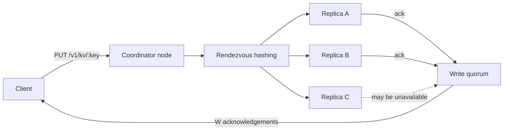

# Distributed Key-Value Store

A from-scratch, leaderless key-value store that explores the engineering behind
systems such as Dynamo and Cassandra: deterministic partitioning, replicated
writes, tunable quorums, version reconciliation, tombstones, and read repair.

This repository is intentionally small enough to understand end to end. It is
an educational system, not a production database.

## What works today

- HTTP `PUT`, `GET`, and `DELETE` operations
- Rendezvous hashing to choose replicas for each key
- Configurable replication factor and read/write quorums
- Parallel replica requests and graceful degradation when a node is unavailable
- Deterministic last-write-wins conflict resolution
- Tombstone deletes that prevent stale replicas from resurrecting values
- Best-effort read repair when replicas disagree
- Race-detector and multi-node integration tests
- Graceful process shutdown

## Architecture



Every node can coordinate a request. For a key, all nodes independently compute
the same ordered replica set. Writes succeed after `W` acknowledgements; reads
query replicas in parallel, require `R` responses, select the newest version,
and repair stale responding replicas.

With replication factor `N`, choosing `R + W > N` gives overlapping read and
write quorums. Conflict resolution still depends on the version model, so this
prototype does not claim linearizability under clock skew or concurrent writes.
See [the architecture notes](docs/architecture.md) for the precise tradeoffs.

## Run a three-node cluster

Requires Go 1.24 or newer. Open three terminals:

```bash
go run ./cmd/kvnode \
  -id node-1 -listen :8080 -advertise http://127.0.0.1:8080 \
  -members node-2=http://127.0.0.1:8081,node-3=http://127.0.0.1:8082
```

```bash
go run ./cmd/kvnode \
  -id node-2 -listen :8081 -advertise http://127.0.0.1:8081 \
  -members node-1=http://127.0.0.1:8080,node-3=http://127.0.0.1:8082
```

```bash
go run ./cmd/kvnode \
  -id node-3 -listen :8082 -advertise http://127.0.0.1:8082 \
  -members node-1=http://127.0.0.1:8080,node-2=http://127.0.0.1:8081
```

Then send requests to any node:

```bash
curl -i -X PUT http://127.0.0.1:8080/v1/kv/language \
  -H 'Content-Type: application/json' \
  -d '{"value":"Go"}'

curl -i http://127.0.0.1:8081/v1/kv/language

curl -i -X DELETE http://127.0.0.1:8082/v1/kv/language
```

Stop one node and repeat the write or read: the default `N=3, R=2, W=2`
configuration continues to serve requests with one unavailable replica.

## API

| Method | Path | Purpose |
| --- | --- | --- |
| `PUT` | `/v1/kv/{key}` | Create or replace a value |
| `GET` | `/v1/kv/{key}` | Read the newest value from a quorum |
| `DELETE` | `/v1/kv/{key}` | Replicate a tombstone |
| `GET` | `/healthz` | Return node and cluster configuration |

The `/internal/v1/records/{key}` endpoints are used for replica traffic and are
not intended as a public API.

## Verify

```bash
go test -race ./...
go vet ./...
go build ./cmd/kvnode
```

## Roadmap

- [x] Replicated in-memory store with quorum reads and writes
- [x] Consistent key placement and read repair
- [ ] Write-ahead log and crash recovery
- [ ] Membership changes and hinted handoff
- [ ] Merkle-tree anti-entropy
- [ ] Prometheus metrics and fault-injection benchmarks
- [ ] Compare the leaderless design with a Raft-backed strongly consistent mode

## License

[MIT](LICENSE)
