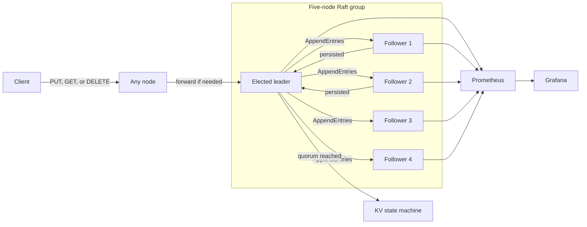

# Distributed Key-Value Store

I built this project to learn what consensus looks like beyond the textbook
pseudocode. It is a persistent key-value database backed by a five-node Raft
cluster, written from scratch in Go.

You can send a request to any node. Followers forward writes to the current
leader, the leader replicates each command, and the value becomes visible only
after a majority has persisted it. The cluster can lose two of its five nodes
and still make progress.

This project also became the storage layer for my
[Distributed LLM Inference Platform](https://github.com/jiholee5217/distributed-llm-inference-platform),
where Raft holds durable control-plane state for a larger distributed system.

## The short version

- Five Go processes elect one leader with `RequestVote` RPCs.
- Writes are ordered and replicated with `AppendEntries`.
- A quorum of three must persist an entry before it is committed.
- `GET` requests use a committed no-op barrier for linearizable reads.
- Terms, votes, logs, and commit progress survive process restarts.
- Prometheus, Grafana, fault scripts, and a concurrent benchmark make the
  cluster's behavior visible and reproducible.

The current version is an educational Raft implementation, not a production
database. It deliberately leaves out snapshotting, log compaction, dynamic
membership, authenticated peer traffic, and horizontal sharding.

## Architecture


```mermaid
flowchart LR
    C["Client"] -->|"PUT, GET, or DELETE"| A["Any node"]
    A -->|"forward if needed"| L["Elected leader"]

    subgraph R["Five-node Raft group"]
        L -->|"AppendEntries"| F1["Follower 1"]
        L -->|"AppendEntries"| F2["Follower 2"]
        L -->|"AppendEntries"| F3["Follower 3"]
        L -->|"AppendEntries"| F4["Follower 4"]
        F1 -->|"persisted"| L
        F2 -->|"persisted"| L
    end

    L -->|"quorum reached"| S["KV state machine"]
    L --> M["Prometheus"]
    F1 --> M
    F2 --> M
    F3 --> M
    F4 --> M
    M --> G["Grafana"]
```

### What happens during a write

1. A client sends a `PUT` or `DELETE` to any node.
2. A follower forwards the request to the leader.
3. The leader appends the command to its log and persists it.
4. Followers receive the entry through `AppendEntries` and persist their copies.
5. Once three nodes have the entry, the leader advances its commit index.
6. Every node applies committed commands to the same deterministic state machine.

The client only receives success after the leader has committed and applied the
command. If leadership changes at the wrong moment, the client may receive a
503 or lose the connection even though the command later commits. That is why
the API does not pretend retries are exactly once.

For deeper diagrams, including elections and recovery, see the
[diagram gallery](docs/diagrams.md).

## Results from my test environment

These runs used the published five-node Docker topology on an Apple M1 Pro.

| Experiment | Successful operations | Errors | Throughput | p95 latency |
| --- | ---: | ---: | ---: | ---: |
| 50/50 PUT and linearizable GET through a follower | 4,174 | 0 | 278.23 ops/s | 203.79 ms |
| Writes while the leader was stopped after 5 seconds | 2,858 | 1,395 | 190.50 ops/s | 165.89 ms |

Without load, the cluster elected a replacement leader in **763 ms**. During
the 32-client write test, replacement took **2.144 seconds** and clients saw
1,363 HTTP 503 responses plus 32 transport failures. After the old leader
restarted, all five nodes returned to zero commit-index lag.

Those failure numbers are part of the result, not something I hid from the
report. Raft preserved safety and recovered, but it did not provide uninterrupted
availability during the election. The exact commands, environment, and raw
interpretation are in the
[benchmark report](docs/results/2026-08-15-five-node.md).

## Run it locally

You only need Docker with Compose:

```bash
docker compose up --detach --build
```

That starts five Raft nodes, Prometheus, and Grafana. The nodes are available on
ports `8081` through `8085`, so any of these requests can go to any node:

```bash
curl -i -X PUT http://127.0.0.1:8081/v1/kv/language \
  -H 'Content-Type: application/json' \
  -d '{"value":"Go"}'

curl -i http://127.0.0.1:8084/v1/kv/language
curl -i -X DELETE http://127.0.0.1:8082/v1/kv/language
```

Open Prometheus at <http://127.0.0.1:9090> and Grafana at
<http://127.0.0.1:3000>. The dashboard is provisioned automatically.

## Break it on purpose

The most useful part of the project is watching it behave under failure:

```bash
./scripts/benchmark.sh
./scripts/failover-demo.sh
./scripts/failover-load.sh
```

The benchmark supports mixed, write-only, and read-only workloads. The failover
scripts stop the elected leader, time the replacement election, write through
the new leader, restart the old one, and wait for it to catch up.

The [operations guide](docs/operations.md) includes inspection commands and a
clean shutdown procedure.

## API

| Method | Path | What it does |
| --- | --- | --- |
| `PUT` | `/v1/kv/{key}` | Replicates and commits a value |
| `GET` | `/v1/kv/{key}` | Commits a read barrier, then reads the state machine |
| `DELETE` | `/v1/kv/{key}` | Replicates and commits a deletion |
| `GET` | `/v1/status` | Shows role, term, leader, and log progress |
| `GET` | `/healthz` | Reports process liveness and Raft identity |
| `GET` | `/metrics` | Exports process, HTTP, and Raft metrics |

Peer RPCs live under `/internal/raft/*` and are intended for the trusted cluster
network. The [client semantics guide](docs/client-semantics.md) explains success,
timeouts, 503s, and safe retry behavior.

## How I tested it

```bash
make verify
```

The verification target runs the race detector, unit tests, the real five-node
integration test, `go vet`, both binary builds, formatting checks, and Docker
Compose validation. The test suite covers:

- election and replacement of a failed leader;
- writes submitted through followers;
- quorum loss preventing commits;
- repair of conflicting follower logs;
- restart replay and persistent catch-up; and
- consensus, HTTP, and process metrics.

CI also checks the shell scripts and Grafana dashboard JSON.

## Finding your way around

```text
cmd/kvnode/            Server entrypoint and configuration
cmd/kvbench/           Concurrent benchmark client
internal/raft/         Elections, replication, persistence, HTTP, and metrics
internal/statemachine/ Deterministic PUT and DELETE application
deploy/                Prometheus and Grafana configuration
scripts/               Benchmark and fault-injection helpers
docs/                  Design notes, diagrams, operations, and results
```

Useful next reads:

- [Architecture](docs/architecture.md) for the consensus invariants and storage design
- [Codebase guide](docs/codebase.md) for how the packages fit together
- [Client semantics](docs/client-semantics.md) before adding automatic retries
- [Recorded results](docs/results/2026-08-15-five-node.md) for the full methodology
- [Roadmap](docs/roadmap.md) for completed work and future milestones

## Tradeoffs and next steps

- Persistence currently rewrites and `fsync`s the full JSON state on every
  safety-critical change. A real storage engine would use a checksummed,
  segmented WAL plus snapshots and compaction.
- Cluster membership is static, and peer HTTP traffic is unauthenticated.
- Reads use log barriers instead of an optimized `ReadIndex` path.
- There is no request-ID deduplication, so automatic retries cannot guarantee
  exactly-once operations.
- A single Raft group serializes every write. Scaling write throughput would
  require sharding or Multi-Raft rather than simply adding more followers.

## License

[MIT](LICENSE)
