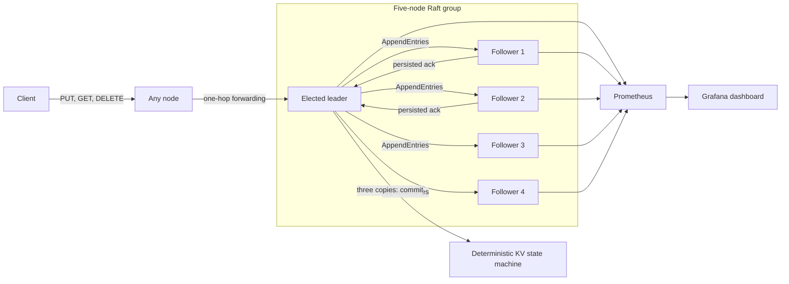

# Distributed Key-Value Store

A from-scratch, persistent key-value database built around the Raft consensus
algorithm. Five Go processes elect one leader, replicate an ordered command log,
and apply writes only after a majority has persisted them.

This repository is the storage foundation for the
[Fault-Tolerant Distributed LLM Inference Platform](https://github.com/jiholee5217/distributed-llm-inference-platform).
Together they tell one engineering story: implement a consensus primitive, then
use it as the strongly consistent control-plane database for a larger system.

> **Status:** The educational Raft baseline implements elections, replicated
> logs, majority commits, linearizable reads, persistent restart recovery,
> five-node fault injection, Prometheus/Grafana observability, and reproducible
> benchmarks. Snapshotting, a segmented WAL, authenticated transport, dynamic
> membership, and horizontal sharding remain roadmap work.

## 60-second project tour

| Question | Answer |
| --- | --- |
| What is implemented? | Raft roles and terms, `RequestVote`, `AppendEntries`, log reconciliation, majority commit, restart replay, and a deterministic key-value state machine. |
| Why five nodes? | A majority of three can continue after two crash-stop failures, although requests may fail during elections. |
| How are reads linearizable? | Every successful `GET` first commits a no-op barrier, proving the leader still reaches a majority in its term. |
| What is persisted? | Current term, vote, complete replicated log, and commit index. |
| How is it tested? | Race tests, a real five-server integration test, quorum-loss and conflicting-log tests, Docker leader crashes, and concurrent benchmarks. |
| What is observable? | Role, term, commit progress, elections, proposals, HTTP traffic, and peer RPC outcomes through Prometheus and Grafana. |

### Evidence ledger

| Claim | Evidence |
| --- | --- |
| Exactly one leader emerges and committed values replicate | [`TestFiveNodeClusterElectsLeaderReplicatesAndFailsOver`](internal/raft/node_test.go) |
| Two remaining nodes cannot commit | Quorum-loss phase of the five-node race test |
| Conflicting follower suffixes are replaced | `TestAppendEntriesReplacesConflictingSuffix` |
| Committed state survives restart | `TestNodeReplaysCommittedLogOnRestart` plus the Docker catch-up demo |
| Metrics represent real consensus activity | `TestMetricsTrackLeadershipProposalAndHTTP` and the provisioned dashboard |
| Performance and failover claims are reproducible | [Recorded results](docs/results/2026-08-15-five-node.md) and scripts in [`scripts`](scripts) |

## System at a glance


```mermaid
flowchart LR
    C["Client"] -->|"PUT, GET, DELETE"| A["Any node"]
    A -->|"one-hop forwarding"| L["Elected leader"]

    subgraph R["Five-node Raft group"]
        L -->|"AppendEntries"| F1["Follower 1"]
        L -->|"AppendEntries"| F2["Follower 2"]
        L -->|"AppendEntries"| F3["Follower 3"]
        L -->|"AppendEntries"| F4["Follower 4"]
        F1 -->|"persisted ack"| L
        F2 -->|"persisted ack"| L
    end

    L -->|"three copies: commit"| S["Deterministic KV state machine"]
    L --> M["Prometheus"]
    F1 --> M
    F2 --> M
    F3 --> M
    F4 --> M
    M --> G["Grafana dashboard"]
```

The leader acknowledges a write only after the entry is persisted by a majority
and applied locally. Followers receive the new commit index in a subsequent
heartbeat and apply the same command in log order.

See the [diagram gallery](docs/diagrams.md), [system design](docs/architecture.md),
and [codebase guide](docs/codebase.md) for deeper walkthroughs.

## Measured results

Recorded on an Apple M1 Pro using the five-node Docker topology at implementation
commit `78322d0`:

| Experiment | Successful operations | Errors | Throughput | p95 |
| --- | ---: | ---: | ---: | ---: |
| 50/50 PUT and linearizable GET through a follower | 4,174 | 0 | 278.23 ops/s | 203.79 ms |
| Write load with leader stopped after 5 seconds | 2,858 | 1,395 | 190.50 ops/s | 165.89 ms |

The no-load leader replacement completed in **763 ms**. Under 32-client write
load, replacement took **2.144 seconds**; requests observed 1,363 HTTP 503s and
32 transport failures during the transition. After the stopped node restarted,
Prometheus reported one leader and zero commit-index lag across all five nodes.

These results demonstrate safety and eventual recovery, not uninterrupted
availability or production storage performance. Full methodology and limitations
are in the [results report](docs/results/2026-08-15-five-node.md).

## Run the complete topology

Requirements: Docker with Compose.

```bash
docker compose up --detach --build
```

This starts five Raft nodes, Prometheus, and Grafana. Nodes are exposed on ports
`8081` through `8085`; send a request to any node:

```bash
curl -i -X PUT http://127.0.0.1:8081/v1/kv/language \
  -H 'Content-Type: application/json' \
  -d '{"value":"Go"}'

curl -i http://127.0.0.1:8084/v1/kv/language
curl -i -X DELETE http://127.0.0.1:8082/v1/kv/language
```

Open Prometheus at <http://127.0.0.1:9090> and the provisioned Grafana dashboard
at <http://127.0.0.1:3000>. The [operations guide](docs/operations.md) covers
status inspection, load tests, leader failure, restart catch-up, and shutdown.

## Reproduce the experiments

```bash
./scripts/benchmark.sh
./scripts/failover-demo.sh
./scripts/failover-load.sh
```

The benchmark accepts `mixed`, `write`, and `read` workloads and records keyspace,
value size, successful throughput, error rate, error categories, and p50/p95/p99.

## API

| Method | Path | Behavior |
| --- | --- | --- |
| `PUT` | `/v1/kv/{key}` | Persist, replicate, and commit a value |
| `GET` | `/v1/kv/{key}` | Commit a read barrier, then read the state machine |
| `DELETE` | `/v1/kv/{key}` | Persist, replicate, and commit a deletion |
| `GET` | `/v1/status` | Return role, term, leader, and log progress |
| `GET` | `/healthz` | Return process liveness and current Raft identity |
| `GET` | `/metrics` | Export Prometheus process, HTTP, and Raft metrics |

The `/internal/raft/*` endpoints carry peer RPCs and must remain on a trusted
cluster network. See [client semantics](docs/client-semantics.md) before adding
automatic retries: a timeout can have an unknown commit outcome.

## Verify locally

```bash
make verify
```

This runs the race detector, unit and five-node integration tests, vet, both
binary builds, formatting checks, Compose validation, and diff checks. CI also
validates shell scripts and the Grafana dashboard JSON.

## Documentation map

| Start here | What it answers |
| --- | --- |
| [Reviewer project overview](docs/project-overview.md) | What is technically interesting and what evidence exists |
| [Diagram gallery](docs/diagrams.md) | How writes, elections, quorums, and recovery fit together |
| [System design](docs/architecture.md) | Consensus invariants, read safety, persistence, and failure behavior |
| [Client semantics](docs/client-semantics.md) | What success, 503, timeout, and retry mean |
| [Operations](docs/operations.md) | How to run, observe, benchmark, and inject faults |
| [Recorded results](docs/results/2026-08-15-five-node.md) | Exact environment, workloads, numbers, and limitations |
| [Codebase guide](docs/codebase.md) | Where each responsibility lives in the repository |
| [Roadmap](docs/roadmap.md) | Completed milestones and explicit production gaps |

## Honest limitations

- Persistence rewrites and `fsync`s the complete JSON log for every safety-critical
  change; there is no segmented WAL, checksum, batching, or snapshot compaction.
- The file is atomically renamed, but the parent directory is not explicitly
  `fsync`ed; crash-consistency claims are therefore limited.
- Membership is static, peer HTTP is unauthenticated, and the failure model is
  crash-stop or network loss rather than Byzantine behavior.
- Reads append log barriers instead of using an optimized `ReadIndex` protocol.
- Clients can observe 503s during elections and need deadline-aware backoff.
  There is no request-ID deduplication or exactly-once operation guarantee.
- One Raft group serializes all writes; horizontal write scaling would require
  sharding or Multi-Raft.

## License

[MIT](LICENSE)
