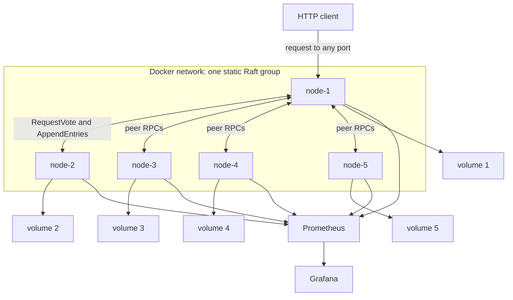
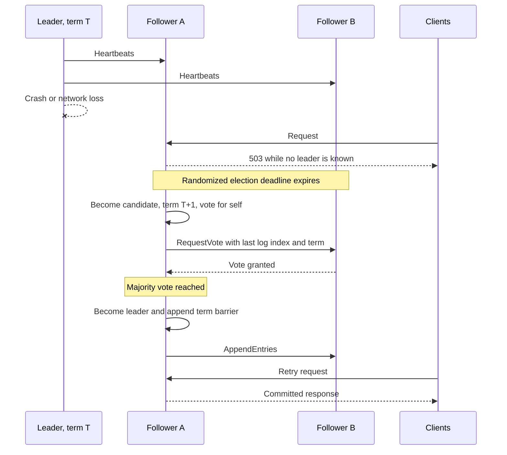
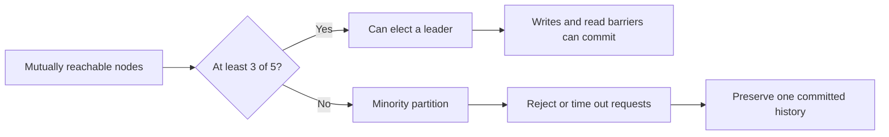
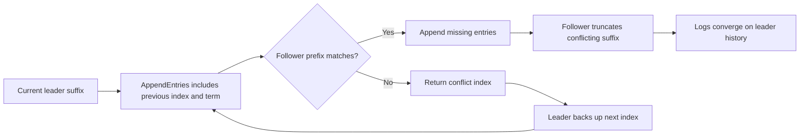
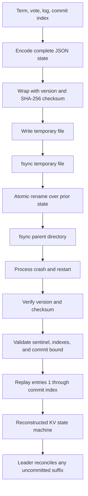

# Diagram gallery

These diagrams describe the implemented five-node system. Planned storage and
scaling work is isolated in the [roadmap](roadmap.md).

## 1. Runtime topology



## 2. Majority-backed write

```mermaid
sequenceDiagram
    autonumber
    participant C as Client
    participant F as Any follower
    participant L as Leader
    participant A as Follower A
    participant B as Follower B
    participant S as KV state machine

    C->>F: PUT /v1/kv/key
    F->>L: Forward once
    L->>L: Append and persist entry
    par Replicate missing suffix
        L->>A: AppendEntries
        L->>B: AppendEntries
    end
    A->>A: Persist log
    B->>B: Persist log
    A-->>L: Success and match index
    B-->>L: Success and match index
    L->>L: Three copies; advance commit index
    L->>S: Apply command in order
    L-->>C: 201 Created
```

The leader plus any two followers form the majority of three. Acknowledging
before that point would allow a later leader to lose a supposedly successful
write.

## 3. Leader failure and replacement



## 4. Safety versus availability



The system chooses consistency over availability when no majority exists.

## 5. Conflicting-log recovery



## 6. Persistence and restart



The transparent full-state format is easy to study but becomes increasingly
expensive as the log grows. WAL segmentation, record-level checksums,
crash-point tests, and snapshots remain future storage milestones.
